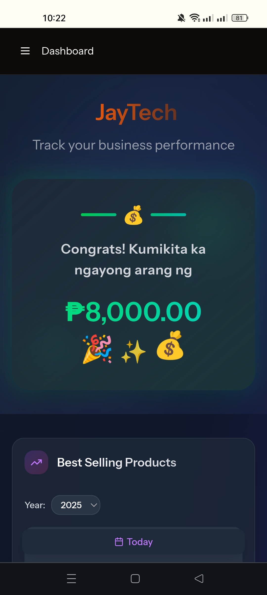
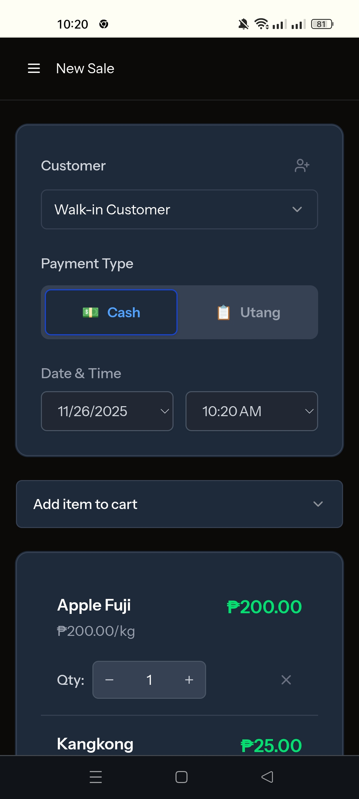
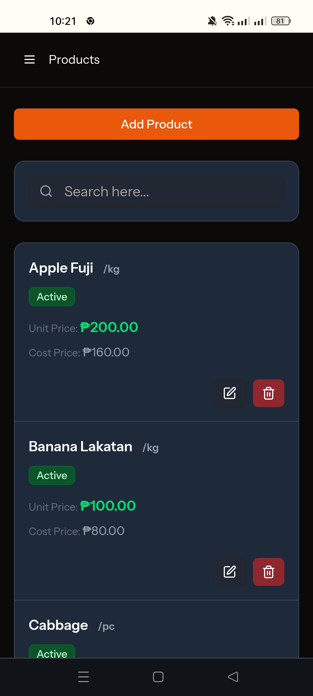
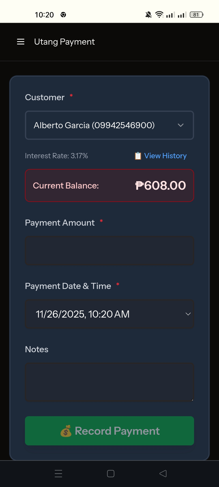
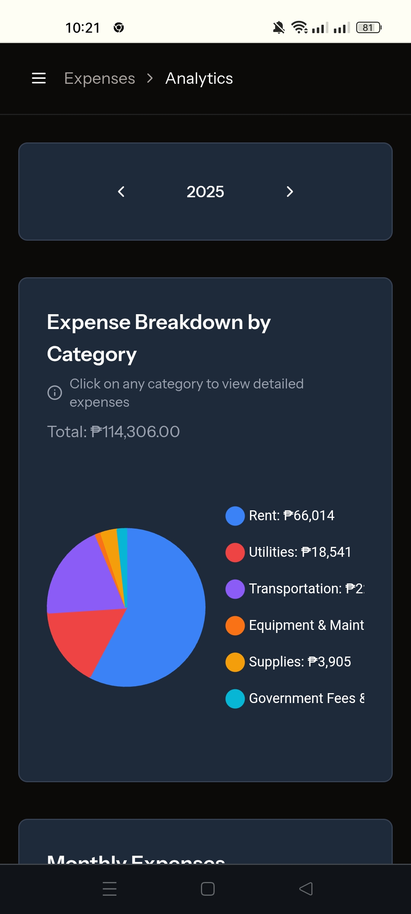

<div align="center">
  <h1>🏪 JayTech POS</h1>
  <p><strong>Modern Point of Sale System for Philippine Retail Businesses</strong></p>
  
  <p>
    
    
    
    
    
  </p>
</div>

---

## 📖 Overview

**JayTech POS** is a comprehensive store management application designed specifically for small to medium-sized retail businesses in the Philippines. Built with modern web technologies, it provides a seamless, responsive experience across all devices while offering powerful features for daily business operations.

### ✨ Key Highlights

- 📱 **Fully Responsive** - Works flawlessly on mobile, tablet, laptop, and desktop
- 🚀 **PWA Enabled** - Install and use like a native app
- 🌓 **Dark/Light Mode** - Eye-friendly interface for any environment
- 🎨 **Modern UI/UX** - Clean, intuitive design for effortless navigation
- ⚡ **Real-time Updates** - Instant data synchronization using Inertia.js
- 🔒 **Secure** - Built-in authentication and authorization with Laravel Fortify

---

## 📸 Screenshots

<div align="center">
  
  
  
</div>

<div align="center">
  
  
  
</div>

---

## 🎯 Core Features

### 📊 **Dashboard**
Monitor your business at a glance with comprehensive analytics:
- Real-time sales revenue tracking
- Best-selling products overview
- Cash flow visualization with Chart.js
- Quick access to key metrics

### 💰 **Sales Transaction**
Streamlined point-of-sale experience:
- Fast and intuitive product selection
- Payment methods supported (Cash & Utang)
- Transaction history tracking

### 💳 **Utang Management**
Comprehensive credit management system:
- Customer payment processing
- Outstanding balance tracking
- Transaction history per customer

### 📝 **Expense Management**
Keep track of business expenses:
- Categorized expense tracking
- Visual analytics and reports

### 📦 **Product Management**
Complete inventory control:
- Add, edit, and delete products
- Unit management

### 👥 **Customer Management**
Build lasting customer relationships:
- Customer database
- Credit tracking
- Customer analytics

### 📈 **Sales Reports**
Data-driven business insights:
- Comprehensive sales analytics
- Customizable date ranges
- Export capabilities
- Performance metrics

---

## 🛠️ Technology Stack

### Backend
- **Laravel 12** - Latest PHP framework with modern features
- **PHP 8.2+** - Type-safe, performant code
- **MySQL** - Reliable relational database
- **Laravel Fortify** - Authentication & security
- **Spatie Activity Log** - Comprehensive audit trails

### Frontend
- **Vue 3** - Progressive JavaScript framework
- **Inertia.js 2** - Modern monolithic SPA approach
- **TypeScript 5** - Type-safe JavaScript
- **Tailwind CSS 4** - Utility-first CSS framework
- **Shadcn** - A set of beautifully designed components
- **Chart.js** - Beautiful data visualizations

### Development Tools
- **Vite** - Lightning-fast build tool
- **Pest 4** - Elegant testing framework
- **Laravel Pint** - Code style fixer
- **ESLint & Prettier** - Code quality tools
- **Laravel Wayfinder** - Automatic route generation

### DevOps
- **Docker** - Containerized development
- **Nginx** - High-performance web server

---

## 🚀 Getting Started

### Prerequisites
- PHP 8.2 or higher
- Composer
- Node.js 18+ and npm
- MySQL 8.0+

### Installation

1. **Clone the repository**
```bash
git clone https://github.com/William-Jay-Inclino/jaytechpos.git
cd jaytechpos
```

2. **Install PHP dependencies**
```bash
composer install
```

3. **Install JavaScript dependencies**
```bash
npm install
```

4. **Environment setup**
```bash
cp .env.example .env
php artisan key:generate
```

5. **Configure your database** in `.env`
```env
DB_CONNECTION=mysql
DB_HOST=127.0.0.1
DB_PORT=3306
DB_DATABASE=jaytechpos
DB_USERNAME=your_username
DB_PASSWORD=your_password
```

6. **Run migrations and seeders**
```bash
php artisan migrate --seed
```

7. **Build frontend assets**
```bash
npm run build
```

8. **Start the development server**
```bash
php artisan serve
```

Visit `https://jaytechsolutions.cloud` to see the application.

### Development with Vite
For hot module replacement during development:
```bash
npm run dev
```

### Docker Setup (Alternative)
```bash
cd docker
cp docker-compose.yml.example docker-compose.yml
docker-compose up -d
```

---

## 🧪 Testing

Run the test suite with Pest:

```bash
# Run all tests
php artisan test

# Run specific test file
php artisan test tests/Feature/ProductTest.php

# Run with coverage
php artisan test --coverage
```

---

## 📝 Code Quality

### Format Code
```bash
# PHP
vendor/bin/pint

# JavaScript/Vue
npm run format
```

### Lint Code
```bash
npm run lint
```

---

## 🏗️ Project Structure

```
jaytechpos/
├── app/
│   ├── Http/Controllers/    # Application controllers
│   ├── Models/              # Eloquent models
│   ├── Policies/            # Authorization policies
│   ├── Services/            # Business logic
│   └── Enums/               # Type-safe enumerations
├── resources/
│   ├── js/                  # Vue components & TypeScript
│   ├── css/                 # Tailwind styles
│   └── views/               # Blade templates
├── routes/
│   ├── web.php             # Web routes
│   ├── admin.php           # Admin routes
│   └── analytics.php       # Analytics routes
├── database/
│   ├── migrations/         # Database migrations
│   ├── factories/          # Model factories
│   └── seeders/            # Database seeders
└── tests/                  # Pest tests
```

---

## 🎨 Features in Detail

### Progressive Web App (PWA)
- Install on any device
- Offline capability
- Fast loading times
- Native app-like experience

### Responsive Design
- Mobile-first approach
- Optimized for touch interfaces
- Adaptive layouts for all screen sizes
- Consistent experience across devices

### User Experience
- Intuitive navigation
- Fast page transitions with Inertia.js
- Toast notifications for user feedback
- SweetAlert2 for beautiful confirmations
- Loading states and skeleton screens

### Security
- Role-based access control
- CSRF protection
- SQL injection prevention
- XSS protection
- Secure authentication flow

---

## 📊 Key Metrics

- **100%** TypeScript coverage on frontend
- **Clean Code** - ESLint & Prettier enforced
- **PSR-12** - PHP coding standards
- **RESTful API** design patterns
- **Optimized** - Code splitting & lazy loading

---

## 📄 License

This project is open-sourced under the MIT license.

---

## 👨‍💻 Developer

**William Jay Inclino**

I'm a full-stack developer passionate about building elegant solutions to real-world problems. JayTech POS demonstrates my expertise in:

- Modern PHP & Laravel development
- Vue.js & TypeScript
- Responsive design & PWA
- RESTful API design
- Database design & optimization
- Test-driven development
- Docker & DevOps
- Clean code principles

**Currently seeking opportunities** as a Full-Stack Developer, Backend Developer, or Frontend Developer.

### 📫 Let's Connect

- GitHub: [@William-Jay-Inclino](https://github.com/William-Jay-Inclino)
- LinkedIn: [Connect with me](https://www.linkedin.com/in/william-jay-inclino-02140022a/) 
- Email: [wjay.inclino@gmail.com](wjay.inclino@gmail.com) 

---

<div align="center">
  <p>⭐ If you find this project interesting, please consider giving it a star!</p>
  <p>Built with ❤️ using Laravel, Vue, and modern web technologies</p>
</div>
